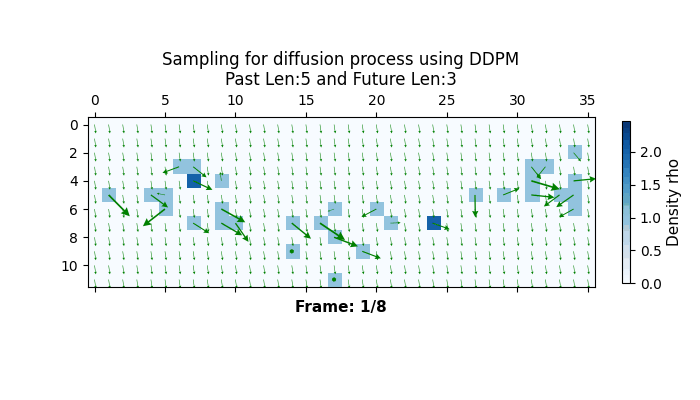

# **Crowd modeling with Denoising Diffusion Probabilisitic**
This project explores the use of Denoising Diffusion Probabilistic Models (DDPMs) to generate sequences of **crowd macroproperties**—aggregated features representing the movement and behavior of pedestrian groups over time.

---

## 📂 Dataset

The full **ATC dataset** contains 41 files, each around **1GB** in size.  
To facilitate training and quick experimentation, a **subset** of the dataset is provided in `datasets/ATC/pickle/`

This subset includes 30-minute pedestrian sequences described by its pre-processed **macroscopic properties**, such as density, velocity, and flow.

---

## ⚙️ Installation

Before training or sampling, install the required dependencies using the provided `requirements.txt`:

```bash
> pip3 install -r requirements.txt
```


## **Training**
To train the model using the provided data subset, simply run:
```bash
> python3 traing.py
```
The training configurations are already set up to work with the subset provided.

## **Sampling example**
Once a model is trained, you can generate new samples from it using the script `generate_samples.py`. This script allows you to visualize the generated macroproperty sequences through both **static** and **dynamic** plots.


Follow the next steps to generate macroproperties sequence samples:
1. **Download the Trained Weights**  
   Download the pretrained model weights from the link below, trained using the full dataset: [Download model weights](https://drive.google.com/file/d/1FKNvEzSVuhrikI3c9KYYSTe8-OTedyNP/view?usp=sharing).

   Place the downloaded weights inside the `saved_models/` directory at the root of the repository.

2. **Generate Samples**  
   You can choose between static or dynamic visualizations, these visualizations help assess how well the diffusion model captures and predicts the dynamics of crowd macroproperties over time:

   #### 🖼️ Static Plot Example
   Run the following command to generate a static visualization of predicted macroproperty sequences. It compares the prediction with the ground truth (GT), shown row by row.

   ```bash
   python3 generate_samples.py --plot-type="Static" --plot-mprop="Density&Vel" --plot-past="Last2" --vel-scale=0.25
   ```
    
   #### 🖼️ Dynamic Plot Example
    Run this command to generate a dynamic animation of the predicted macroproperties. The animation displays past frames followed by predicted frames, marked with black and blue labels for clarity at the bottom.
    ```bash
    > python3 generate_samples.py --plot-type="Dynamic" --vel-scale=0.25 --vel-unc-scale=3
    ```
    Below is an example from one of the generated sequences:
    